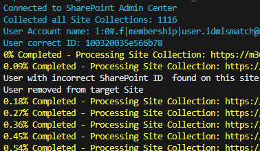

# Repair ID mismatch for user across all Sites

## Summary

This script removes the account of a user whose ID doesn’t match with the ID that is in the UserInfo list of the site. This action is performed across all Site Collection and OneDrive in the tenant.

While the current official solution is resolving the issue manually site by site using the diagnostics in *Microsoft 365 Admin Center*; [Fix site user ID mismatch in SharePoint or OneDrive]( https://learn.microsoft.com/en-us/sharepoint/troubleshoot/sharing-and-permissions/fix-site-user-id-mismatch), the script aims to resolve this issue in a single run across all sites in the tenant.

Summary of the script functionality:
- Connects to SharePoint Online.
- Gets the affected user account from SharePoint user list and reads the SID value.
- Gets all Sites and iterates through them performing the below actions:
  - Account used to run the script (*Global/SharePoint Admin*) is added to the Site collection administrator.
  - Check if the affected user is in the UserInfo list.
  - If the user is found, it checks if the SID value is the same as the one obtained at the beginning.
  - If the SIP value doesn’t match, the user is removed from the site and the action is recorded on the csv report.
  - Account used to run the script (*Global/SharePoint Admin*) is removed as the Site collection administrator.

Important points to be aware on the script:
1. Due to the expected high workload, it’s recommended running the script separately for OneDrive and Site Collections. Then you can avoid the script running for too long.
2. The script has a ***ReportMode*** when it is set to *\$true*, it won’t perform any deletion action, but the report of where the user is registered with the wrong ID will be recorded in the report. Otherwise set it to *\$false* and the user with wrong ID will be remove from the sites.

After running the script you will need to grant access again to the site for the affected user. Same process as if you use the diagnostic from *Microsoft 365 Admin Center*.

> [!Note]
> The script relies on the PnP PowerShell module to interact with SharePoint Online, and it is essential to have the module installed and authenticated before executing the script.

[!INCLUDE [Delete Warning](../../docfx/includes/DELETE-WARN.md)]



# [PnP PowerShell](#tab/pnpps)

```powershell
#################################################################
# DEFINE PARAMETERS FOR THE CASE
#################################################################
$AdminSiteURL = "https://contoso-admin.sharepoint.com" # SharePoint Admin Center Url
$SiteCollAdmin = "admin@email.com" # Global or SharePoint Admin used for loging running the script.
$AffectedUser = "affecteduser@email.com>" # Email of the affected user.
$ReportMode = $true


#################################################################
# REPORT AND LOGS FUNCTIONS
#################################################################

Function Add-ReportRecord($SiteURL, $Action)
{
    $Record = New-Object PSObject -Property ([ordered]@{
        "Site URL"          = $SiteURL
        "Action"            = $Action
        })
    
    $Record | Export-Csv -Path $ReportOutput -NoTypeInformation -Append
}

Function Add-ScriptLog($Color, $Msg)
{
    Write-host -f $Color $Msg
    $Date = Get-Date -Format "yyyy/MM/dd HH:mm"
    $Msg = $Date + " - " + $Msg
    Add-Content -Path $LogsOutput -Value $Msg
}

# Create Report location
$FolderPath = "$Env:USERPROFILE\Documents\"
$Date = Get-Date -Format "yyyyMMddHHmmss"
$ReportName = "IDMismatchSPO"
$FolderName = $Date + "_" + $ReportName
New-Item -Path $FolderPath -Name $FolderName -ItemType "directory"

# Files
$ReportOutput = $FolderPath + $FolderName + "\" + $FolderName + "_report.csv"
$LogsOutput = $FolderPath + $FolderName + "\" + $FolderName + "_Logs.txt"

Add-ScriptLog -Color Cyan -Msg "Report will be generated at $($ReportOutput)"


#################################################################
# SCRIPT LOGIC
#################################################################
function Remove-UserIDMismatch ($Site) {
    try {
        Connect-PnPOnline -Url $Site.Url -Interactive -ErrorAction Stop

        $User = Get-PnPUser -Identity $properties.AccountName | Where-Object { $_.Email -eq $AffectedUser -and $_.UserId.NameId -ne $UserID }
        
        If ($User.Length -ne 0) {
            Add-ScriptLog -Color White -Msg "User with incorrect SharePoint ID $($Site.UserId.NameId) found on this site."
            
            if($User.IsSiteAdmin) {                
                if ($ReportMode -eq $false) { Remove-PnPSiteCollectionAdmin -Owners $AffectedUser -ErrorAction Stop }
                Add-ScriptLog -Color White -Msg "User $($properties.AccountName) removed as Site Collection Admin"
                Add-ReportRecord -SiteURL $Site.Url -Action "User $($properties.AccountName) removed as Site Collection Admin"
            }
    
            if ($ReportMode -eq $false) { Remove-PnPUser -Identity $User.ID -Force -ErrorAction Stop }
            Add-ScriptLog -Color White -Msg "User $($properties.AccountName) removed from target Site"
            Add-ReportRecord -SiteURL $Site.Url -Action "User $($properties.AccountName) removed from target Site"
        }

    }
    catch {
        throw
    }
}


try {
    Connect-PnPOnline -Url $AdminSiteURL -Interactive -ErrorAction Stop
    Add-ScriptLog -Color Cyan -Msg "Connected to SharePoint Admin Center"

    # Get all Site Collections
    $collSiteCollections = Get-PnPTenantSite | Where-Object{ ($_.Title -notlike "" -and $_.Template -notlike "*Redirect*") }
    
    # Get all OneDrive
    # $collSiteCollections = Get-PnPTenantSite -IncludeOneDriveSites -Filter "Url -like '-my.sharepoint.com/personal/'" | Where-Object{ $_.Title -notlike "" -and $_.Template -notlike "*Redirect*" }
    
    Add-ScriptLog -Color Cyan -Msg "Collected all Site Collections: $($collSiteCollections.Count)"
}
catch {
    Add-ScriptLog -Color Red -Msg "Error: $($_.Exception.Message)"
    break
}


try {
    
    $properties = Get-PnPUserProfileProperty -Account $AffectedUser
    $UserID = $properties.UserProfileProperties.SID -replace ("i:0h.f|membership|", '')
    $UserID = $UserID -replace ('@live.com', '')
    $UserID = $UserID.Trim('|')

    Add-ScriptLog -Color Cyan -Msg "User Account name: $($properties.AccountName)"
    Add-ScriptLog -Color Cyan -Msg "User correct ID: $($UserID)"
    
}
catch {
    Add-ScriptLog -Color Red -Msg "Error message: '$($_.Exception.Message)'"
    Add-ScriptLog -Color Red -Msg "Error trace: '$($_.Exception.ScriptStackTrace)'"
    break
}


$ItemCounter = 0
ForEach($oSite in $collSiteCollections) {

    $PercentComplete = [math]::Round($ItemCounter/$collSiteCollections.Count * 100, 2)
    Add-ScriptLog -Color Yellow -Msg "$($PercentComplete)% Completed - Processing Site Collection: $($oSite.Url)"
    $ItemCounter++

    Try {
        Set-PnPTenantSite -Url $oSite.Url -Owners $SiteCollAdmin

        Remove-UserIDMismatch -Site $oSite -ErrorAction Stop
        
    }
    Catch {
        Add-ScriptLog -Color Red -Msg "Error while processing Site Collection '$($Site.Url)'"
        Add-ScriptLog -Color Red -Msg "Error message: '$($_.Exception.Message)'"
        Add-ScriptLog -Color Red -Msg "Error trace: '$($_.Exception.ScriptStackTrace)'"
        Add-ReportRecord -SiteURL $oSite.Url -Action $_.Exception.Message
    }

    Connect-PnPOnline -Url $oSite.Url -Interactive
    Remove-PnPSiteCollectionAdmin -Owners $SiteCollAdmin

}

Add-ScriptLog -Color Cyan -Msg "100% Completed - Finished running script"
Add-ScriptLog -Color Cyan -Msg "Report generated at at $($ReportOutput)"
```
[!INCLUDE [More about PnP PowerShell](../../docfx/includes/MORE-PNPPS.md)]


***


## Source Credit

Sample first appeared on [https://github.com/Barbarur/NovaPointPowerShell/tree/main/Solutions/QuickFix](https://github.com/Barbarur/NovaPointPowerShell/tree/main/Solutions/QuickFix)

## Contributors

| Author(s)         |
| ----------------- |
| Alvaro Avila Ruiz |


[!INCLUDE [DISCLAIMER](../../docfx/includes/DISCLAIMER.md)]
